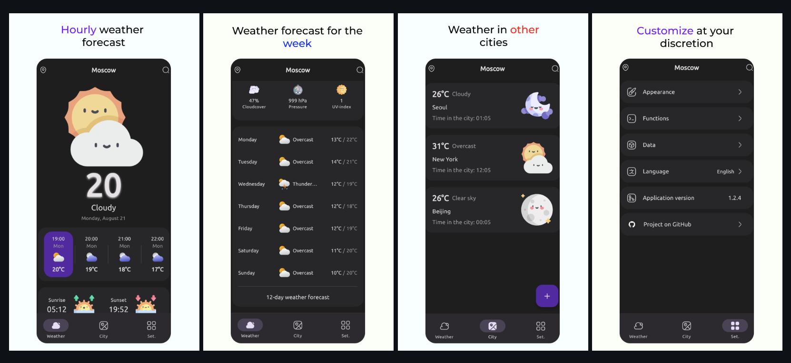
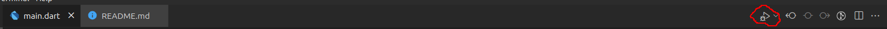
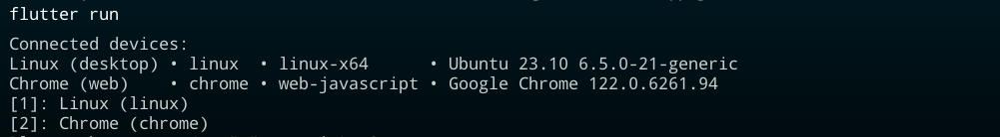

# ICM Homework Individual Assignment

## José Gameiro 108840 - LEI

### Objectives

Use flutter to clone existing / concept app and, by doing so, use/explore flutter UI widgets and basic navigation options

So with this I decided to clone the following weather app:



### App Description

Its composed by 3 simple screens:
- The home page with the current weather, the hourly forecast, the informations of the sunrise and sunset and additional like pressure, UV-incidence and Cloudcover. It also shows the daily forecast for the next 7 days.

- The cities page where its displayed informations about 3 cities, the weather and a little description, the name of the city and the time.

- And the settings page displaying the options that the user can change/check which include the appearance of the app, the functions, data. language and version of the application, 

### Additional Notes

The data inside the pages are all static just as the buttons inside the cities page and the options inside the settings page are also static.

### Instructions to execute

To run the app you need to have flutter installed and an emulator running or a physical device connected to the computer.
You can run the app by using the following command in a terminal inside the weather_app folder or run the app using Visual Studio Code by pressing the following button or by pressing F5 in the main.dart file:



Or

```bash
flutter run
```

It might appear this message in the terminal:



If that happens, simply select the device that you'll want to see you're app running.
